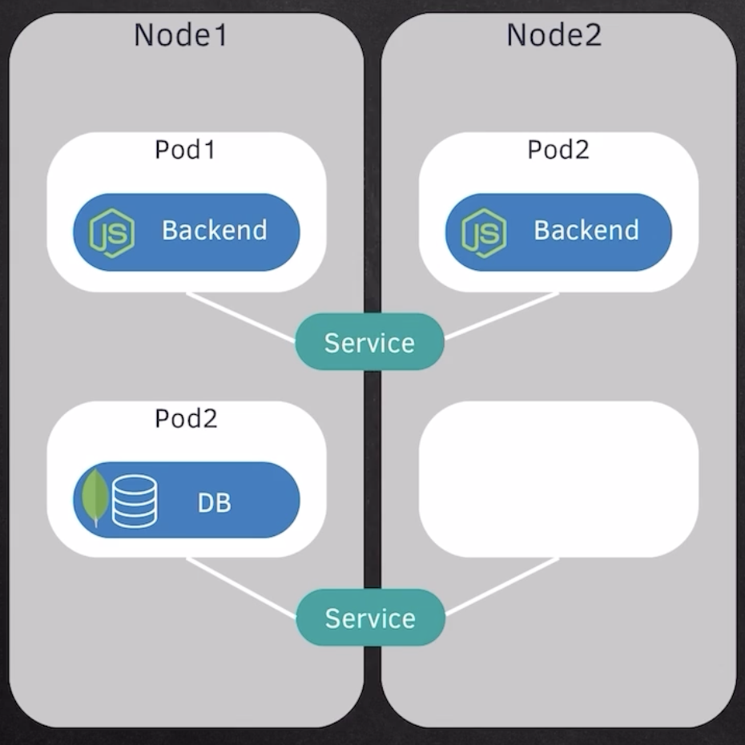
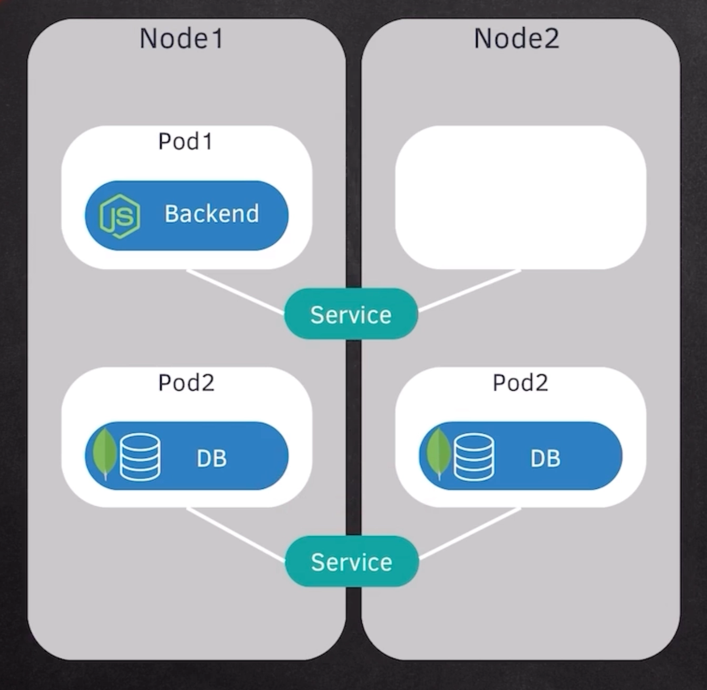

# Deployment & Stateful

## 1. Basic Scenario

Let’s assume a simple application setup:

- **Pod 1** → Running the **backend application**
- **Pod 2** → Running the **database**
- A **Service** is attached to enable communication between them

### Problem

If the **backend pod fails**, the entire backend of the application becomes unavailable.

That means:

- No requests can be processed
- The application effectively goes down

👉 This is why **backup and redundancy** are critical.

---

## 2. Why We Need Replication

To avoid downtime:

- There should always be **multiple copies (replicas)** of a pod
- If one pod fails, another should immediately take over

This ensures:

- High availability
- Fault tolerance
- Zero (or minimal) downtime

---

## 3. Role of Deployment

To manage replicas, Kubernetes uses a concept called a **Deployment**.

### What is a Deployment?

A **Deployment** is like a **blueprint** that defines:

- How many pods should run
- What configuration they should have
- How updates should be handled

---

### Example

```
Desired Pods = 3
Actual Running Pods = 2
```

👉 The Deployment will automatically create **1 more pod** to match the desired state.

---

### Key Responsibilities of Deployment

1. **Maintains Desired State**
   - Ensures the number of running pods always matches the desired count
2. **Self-Healing**
   - If a pod crashes, a new one is automatically created
3. **Scaling**
   - You can scale up/down easily:
     - Increase replicas → more pods
     - Decrease replicas → fewer pods
4. **Rolling Updates**
   - Update application without downtime
5. **Rollbacks**
   - Revert to a previous stable version if something breaks

---

## 4. Role of Service (Load Balancing)

A **Service** acts like a **load balancer**.

### How it works:

- It distributes incoming requests across multiple pods
- If one pod fails:
  - Traffic is automatically redirected to healthy pods

👉 Important clarification:

- Service does **not send traffic to another node**
- It sends traffic to **another healthy pod (replica)**

---

## 5. Multi-Node Scenario

- Pods can run across multiple **nodes (machines)**
- If one **node fails**:
  - Kubernetes reschedules pods on other available nodes

👉 This ensures:

- Infrastructure-level fault tolerance
- Not just pod-level recovery

---

## 6. Multiple Deployments in One Application

A single application can have **multiple deployments**, for example:

- Backend deployment
- Frontend deployment
- Worker services

Each deployment:

- Can scale independently
- Can be updated independently

---

## 7. Why Deployments Are NOT Suitable for Databases

Databases are **stateful applications**, meaning:

- They store persistent data
- They depend on:
  - Order
  - Consistency
  - Data integrity

### Problems with using Deployment for DB:

- Pods are **stateless and interchangeable**
- No guarantee:
  - Same identity
  - Same storage
- Leads to:
  - Data inconsistency
  - Data loss risks

---

## 8. StatefulSet for Databases

To handle stateful applications, Kubernetes provides **StatefulSet**.

### Features of StatefulSet:

1. **Stable Identity**
   - Each pod has a fixed name (e.g., db-0, db-1)
2. **Persistent Storage**
   - Each pod gets its own persistent volume
3. **Ordered Deployment**
   - Pods start and stop in sequence
4. **Data Consistency**
   - Helps maintain sync between replicas

---

### Supported Databases

StatefulSets are commonly used for:

- MySQL
- PostgreSQL
- MongoDB
- Elasticsearch

---

## 9. Reality in Large Organizations

Even though Kubernetes supports StatefulSets:

👉 In real-world large-scale systems:

- Running databases inside Kubernetes is **complex**
- Requires careful management of:
  - Replication
  - Backup
  - Failover

### Common Practice

- Backend services → run inside Kubernetes
- Databases → hosted externally (managed services)

Examples:

- AWS RDS
- Google Cloud SQL
- MongoDB Atlas

👉 Kubernetes applications communicate with these external databases.

---

## 10. Final Summary

- **Pods** run applications
- **Deployments** manage stateless applications:
  - Replication
  - Scaling
  - Updates
  - Self-healing
- **Services** provide load balancing
- **StatefulSets** handle stateful applications like databases
- In production:
  - Stateless apps → Kubernetes
  - Databases → usually external systems




